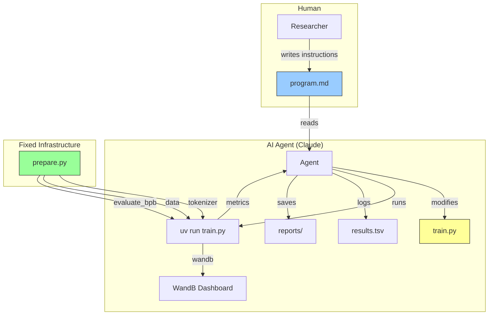
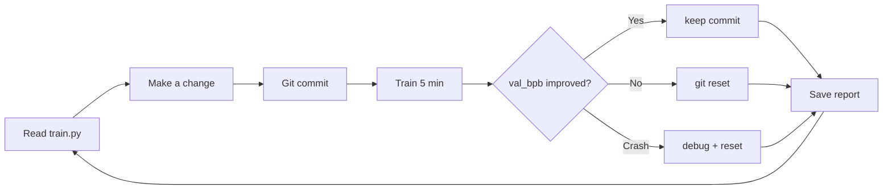
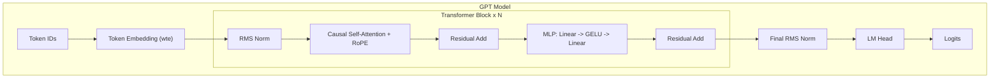
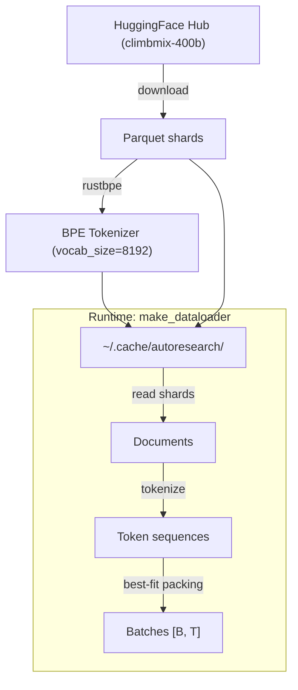
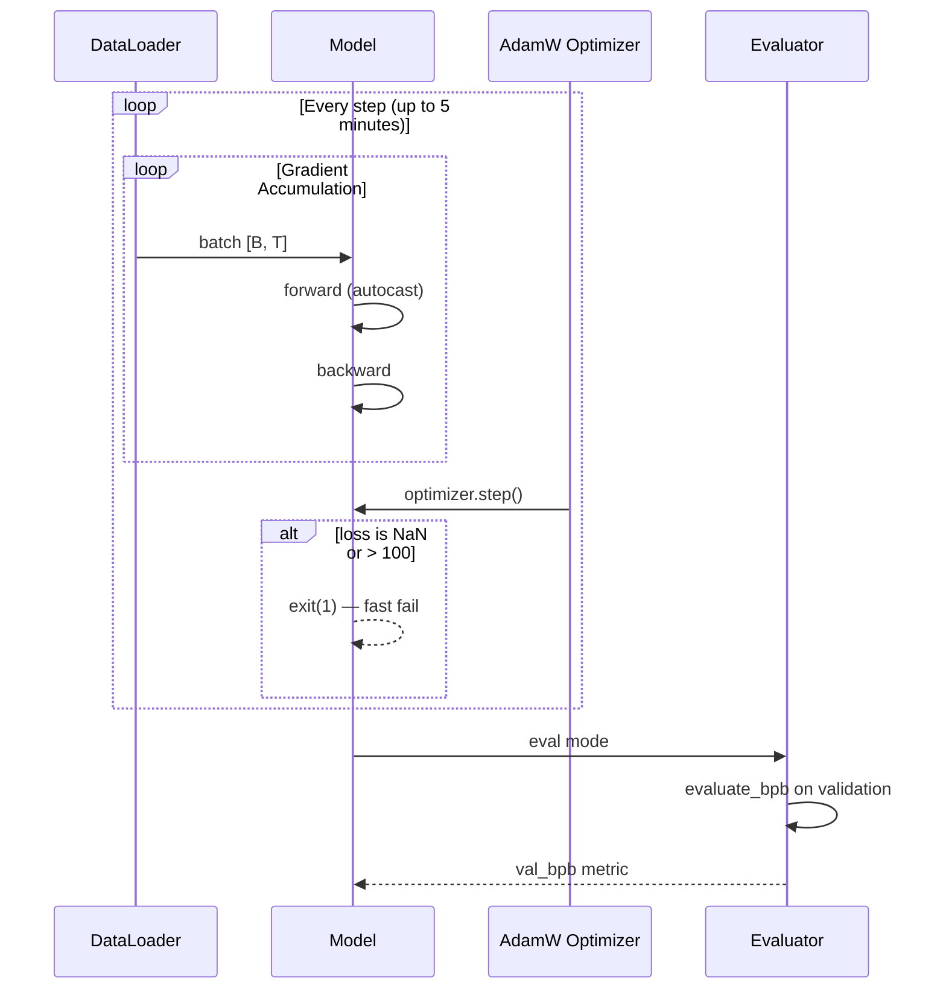
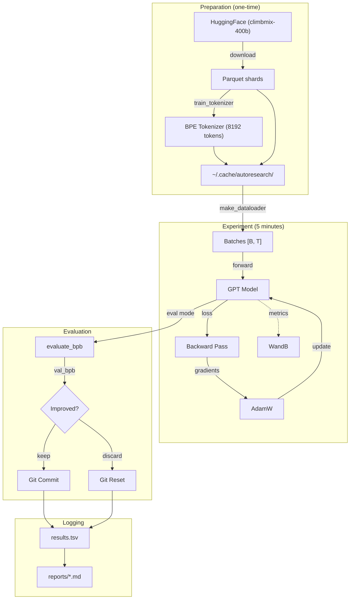

# autoresearch

Autonomous ML research system. An AI agent iterates on `train.py` to minimize `val_bpb` (validation bits per byte) within a fixed 5-minute training budget. Based on [karpathy/autoresearch](https://github.com/karpathy/autoresearch).

This fork adds:
- **WandB integration** for experiment tracking
- **Adapter system** for running on different GPU platforms (Kaggle P100, etc.)
- **Experiment reports** saved per-run to `reports/`
- **Simplified train.py** — vanilla GPT + AdamW baseline, multi-GPU compatibility

## Architecture Overview



**Key principle:** exactly one mutable file — `train.py`. Everything else is fixed, ensuring fair experiment comparison.

## Experiment Cycle



The agent runs in an infinite loop until manually stopped. Each experiment is logged in `results.tsv` and a report is saved to `reports/`.

## Project Structure

```
autoresearch/
├── train.py            # Model + optimizer + training loop (AGENT MODIFIES)
├── prepare.py          # Data, tokenizer, evaluation (READ-ONLY)
├── program.md          # Agent instructions (HUMAN EDITS)
├── pyproject.toml      # Dependencies
├── analysis.ipynb      # Result analysis
├── reports/            # Per-experiment markdown reports
├── adapters/
│   └── kaggle/         # Kaggle GPU adapter
│       ├── adapter.py
│       ├── notebook.py
│       ├── kernel-metadata.json
│       ├── .env        # API keys (git-ignored)
│       └── DESCRIPTION.md
└── progress.png
```

| File | Purpose | Modified by |
|------|---------|-------------|
| `train.py` | GPT model + training | Agent |
| `prepare.py` | Data + tokenizer + metric | Nobody |
| `program.md` | Agent rules | Human |

## Quick Start

**Requirements:** Single NVIDIA GPU, Python 3.10+, [uv](https://docs.astral.sh/uv/).

```bash
# Install dependencies
uv sync

# Download data and train tokenizer (one-time, ~2 min)
uv run prepare.py

# Run a single training experiment (~5 min)
uv run train.py
```

### Running the Agent

```bash
# Point Claude Code at the instructions
claude -p program.md
```

The agent reads `program.md`, modifies `train.py`, trains, evaluates, and repeats.

## Model Architecture

Vanilla GPT transformer with standard components:



**Components:**
- **Embedding** — standard token embedding with RMS normalization
- **Attention** — multi-head causal self-attention with RoPE (Rotary Position Embeddings)
- **MLP** — standard 4x expansion with GELU activation
- **Flash Attention 3** on SM80+ GPUs, falls back to PyTorch SDPA on older GPUs
- **RMS Norm** — used throughout instead of LayerNorm

### Default Hyperparameters

```python
DEPTH = 8               # transformer layers
ASPECT_RATIO = 64       # model_dim = depth * 64
HEAD_DIM = 128          # attention head dimension
TOTAL_BATCH_SIZE = 2**19  # ~524K tokens per step
LEARNING_RATE = 3e-4
WEIGHT_DECAY = 0.1
WARMUP_RATIO = 0.05     # 5% warmup
WARMDOWN_RATIO = 0.5    # 50% cosine decay
DEVICE_BATCH_SIZE = 128
```

## Data Pipeline



| Constant | Value | Purpose |
|----------|-------|---------|
| `MAX_SEQ_LEN` | 2048 | Context length |
| `TIME_BUDGET` | 300s | Training time (5 min) |
| `EVAL_TOKENS` | ~21M | Validation tokens |
| `VOCAB_SIZE` | 8192 | BPE vocabulary size |

### Metric: Bits Per Byte (BPB)

```
BPB = total_nats / (ln(2) * total_bytes)
```

BPB is vocab-size-independent, allowing fair comparison across different tokenizer configurations.

## Training Loop



- **Time-based LR schedule** — warmup -> constant -> cosine decay, tied to wall-clock progress
- **GradScaler** — enabled automatically for fp16 (older GPUs), no-op for bf16
- **Gradient clipping** — max_norm=1.0
- **torch.compile** — enabled on SM70+ GPUs, skipped on older hardware
- **Fast-fail** — training aborts on NaN or loss > 100

## GPU Compatibility

| GPU | Capability | Precision | torch.compile | Flash Attn | Notes |
|-----|-----------|-----------|--------------|------------|-------|
| H100 | SM90 | bf16 | Yes | FA3 | Reference platform |
| A100 | SM80 | bf16 | Yes | FA3 | |
| V100 | SM70 | fp16 + GradScaler | Yes | SDPA fallback | |
| T4 | SM75 | fp16 + GradScaler | Yes | SDPA fallback | |
| P100 | SM60 | fp16 + GradScaler | No | SDPA fallback | Requires torch 2.4.1+cu118 |

Automatic detection: the script reads `torch.cuda.get_device_capability()` and adjusts precision, attention backend, and compilation accordingly.

## WandB Integration

Training metrics are logged to [Weights & Biases](https://wandb.ai/) when `WANDB_API_KEY` is set:

- **Per-step** (every 10 steps): `train/loss`, `train/lr_multiplier`, `train/tokens_per_sec`, `train/mfu_percent`, `train/progress`
- **Final summary**: `val_bpb`, `training_seconds`, `peak_vram_mb`, `mfu_percent`, `total_tokens_M`, `num_steps`, `num_params_M`

Graceful fallback: if `wandb` is not installed or `WANDB_API_KEY` is not set, logging is silently skipped.

```bash
export WANDB_API_KEY=your_key
export WANDB_PROJECT=autoresearch  # optional, defaults to "autoresearch"
```

## Adapters

Adapters allow running autoresearch on different GPU platforms.

### Kaggle P100

The `adapters/kaggle/` directory contains everything needed to run on Kaggle's free P100 GPUs:

1. Copy `.env.example` to `.env` and fill in your API keys
2. Push the notebook to Kaggle:
   ```bash
   cd adapters/kaggle
   kaggle kernels push
   ```
3. The notebook installs `torch==2.4.1+cu118` (P100 compatibility), embeds `prepare.py` and `train.py` via base64, and runs the full training pipeline.

P100-specific tuning in the notebook: `DEPTH=6`, `DEVICE_BATCH_SIZE=16` to fit 16GB VRAM.

## Output Format

### Training log (overwritten via `\r`)

```
step 00150 (42.3%) | loss: 4.123456 | lrm: 1.00 | dt: 312ms | tok/sec: 1,680,000 | mfu: 45.2% | epoch: 1 | remaining: 173s
```

### Final summary (after training completes)

```
---
val_bpb:          1.187432
training_seconds: 300.1
total_seconds:    342.5
peak_vram_mb:     14230.8
mfu_percent:      44.50
total_tokens_M:   95.4
num_steps:        182
num_params_M:     46.2
depth:            8
```

The agent parses the `---` summary block to extract `val_bpb` and decide whether to keep or discard the commit.

### Experiment Reports

Each experiment generates a report in `reports/{N}_{timestamp}.md` with:
- Hypothesis and changes
- Metrics table (val_bpb, delta, VRAM, MFU, etc.)
- Result verdict and notes

### results.tsv

```
commit	val_bpb	memory_gb	status	description
a1b2c3d	0.997900	44.0	keep	baseline
b2c3d4e	0.993200	44.2	keep	increase LR to 0.04
c3d4e5f	0.000000	0.0	crash	double model width (OOM)
```

## Full Data Flow



## Design Choices

- **Single file to modify.** The agent only touches `train.py`. Diffs stay reviewable and experiments stay comparable.
- **Fixed time budget.** Training always runs for exactly 5 minutes. This makes experiments comparable regardless of what the agent changes and finds the optimal model for your specific GPU.
- **Self-contained.** No heavy frameworks. One GPU, one file, one metric.
- **Adapter pattern.** Platform-specific setup lives in `adapters/`, keeping the core code clean.

## License

MIT
